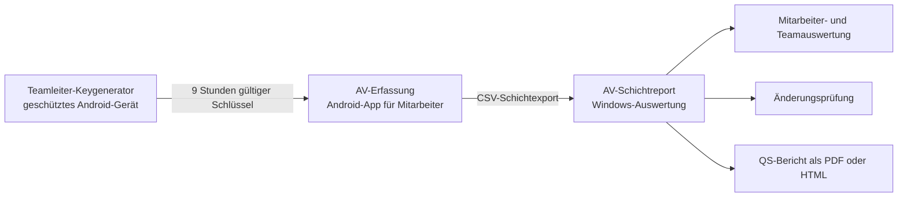
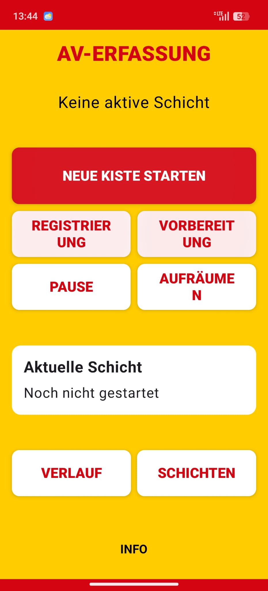
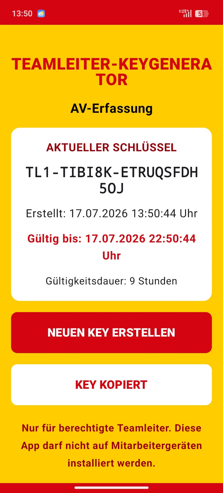
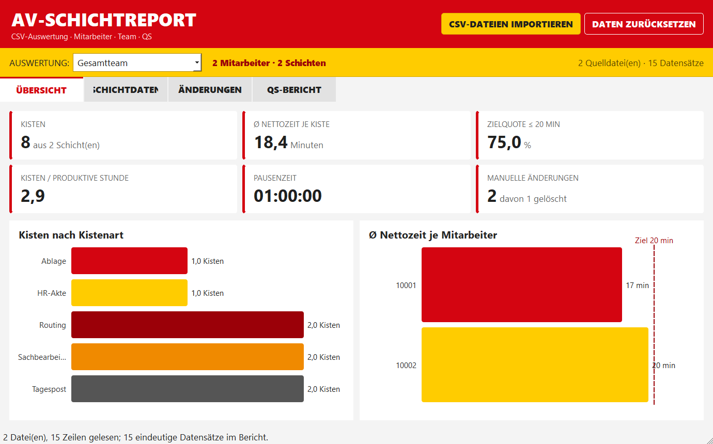

# AV-Erfassung

<p align="center">
  <strong>Schichtbasierte Erfassung, kontrollierte Teamleiter-Korrektur und verständliche Qualitätsauswertung</strong>
</p>

<p align="center">
  <a href="https://github.com/kruemmel-python/AV-Erfassung/releases/latest"><strong>Aktuelles Release herunterladen</strong></a>
  ·
  <a href="Handbuch/Mitarbeiterhandbuch_AV-Erfassung.pdf">Mitarbeiterhandbuch</a>
  ·
  <a href="Handbuch/Benutzerhandbuch_AV-Schichtreporter.pdf">Handbuch AV-Schichtreport</a>
</p>

AV-Erfassung ist eine lokal arbeitende Gesamtlösung für die Erfassung und Auswertung von Kistenbearbeitungen. Das Projekt besteht aus zwei Android-Apps und einem portablen Windows-Programm. Mitarbeiter erfassen ihre Schicht direkt am Android-Gerät, Teamleiter können fehlerhafte Erfassungen kontrolliert korrigieren und der AV-Schichtreport bereitet mehrere CSV-Exporte als Mitarbeiter-, Team- und QS-Auswertung auf.

## Anwendungen im Überblick

| Anwendung | Plattform | Version | Aufgabe | Download |
| --- | --- | ---: | --- | --- |
| **AV-Erfassung** | Android 8 oder neuer | 2.0.3 | Schichten, Kisten, Arbeitsprozesse und Unterbrechungen erfassen | [APK](https://github.com/kruemmel-python/AV-Erfassung/releases/latest/download/AV-Erfassung-release.apk) |
| **Teamleiter-Keygenerator** | Android 8 oder neuer | 1.0.0 | Neun Stunden gültige Freigabeschlüssel für Korrekturen erzeugen | [APK](https://github.com/kruemmel-python/AV-Erfassung/releases/latest/download/Teamleiter-Keygenerator-release.apk) |
| **AV-Schichtreport** | Windows, portabel | 1.0.0 | CSV-Dateien importieren, Änderungen prüfen und QS-Berichte erstellen | [ZIP](https://github.com/kruemmel-python/AV-Erfassung/releases/latest/download/AV-Schichtreport-portable.zip) |

> [!IMPORTANT]
> Der Teamleiter-Keygenerator gehört ausschließlich auf geschützte Geräte berechtigter Teamleiter. Er darf nicht auf Mitarbeitergeräten installiert oder frei weitergegeben werden.

## Zusammenspiel der drei Anwendungen



Alle Arbeitsdaten werden lokal verarbeitet. Die Anwendungen führen keine automatische Cloud- oder Netzwerkübertragung durch.

---

## 1. AV-Erfassung für Mitarbeiter

Die Android-App begleitet die komplette Schicht: von der Eingabe der Personalnummer über die Auswahl der Kistenart bis zum Schichtabschluss und CSV-Export. Die Oberfläche nutzt große, kontrastreiche Bedienelemente in DHL-typischen Farben.

<p align="center">
  
</p>

### Erfasste Vorgänge

- Kistenarten: Tagespost, Sachbearbeitung, Rückläufer, Routing, Ablage und HR-Akte
- numerische Personalnummer vor dem Start
- automatische Kistennummern im Format `JJJJ-MM-TT-NNN`
- Arbeitsprozesse und Kistenwechsel
- Pause, Registrierung, Image und Diverse
- verpflichtender Kurztext bei Diverse
- Früh-, Spät- und Nachtschichten
- Verlauf, Schichtbericht und Tagesstatistik
- UTF-8-CSV-Export mit Personalnummer, Zeiten, Kistenart und Änderungsprotokoll

### Zuverlässigkeit und Nachvollziehbarkeit

- sofortige lokale Speicherung mit Room/SQLite
- robuste Zeitmessung über UTC, `elapsedRealtime` und Boot-Zähler
- Wiederherstellung einer laufenden Erfassung nach einem Neustart
- sichtbare Kennzeichnung manuell geänderter oder gelöschter Kisten
- gelöschte Kisten bleiben als Prüfspur erhalten, fließen aber nicht in Leistungskennzahlen ein
- Diagnoseansicht ohne sensible Kisten- oder Personaldaten

### Installation

1. [AV-Erfassung-release.apk](https://github.com/kruemmel-python/AV-Erfassung/releases/latest/download/AV-Erfassung-release.apk) auf das Android-Gerät laden.
2. In Android die Installation aus der verwendeten Datei-App beziehungsweise dem Browser erlauben.
3. Die APK öffnen und **INSTALLIEREN** wählen.
4. AV-Erfassung starten und vor der ersten Erfassung die angezeigte Schicht sowie die Personalnummer prüfen.

Die vollständige Bedienung ist im [bebilderten Mitarbeiterhandbuch](Handbuch/Mitarbeiterhandbuch_AV-Erfassung.pdf) beschrieben. Es enthält zusätzlich einen eigenen Bereich für Teamleiter.

---

## 2. Teamleiter-Keygenerator

Der separate Keygenerator erzeugt zeitlich begrenzte Schlüssel. Erst nach erfolgreicher Freischaltung kann ein Teamleiter abgeschlossene Kisten vollständig korrigieren oder als gelöscht markieren.

<p align="center">
  
</p>

### Eigenschaften

- separate Android-App mit eigenem Paketnamen
- jeder Schlüssel ist ab der Erstellung exakt neun Stunden gültig
- Schlüssel kann direkt in die Zwischenablage kopiert werden
- keine Netzwerkverbindung zur Mitarbeiter-App erforderlich
- klare Anzeige von Erstellungszeit und Ablaufzeit

### Teamleiter-Berechtigungen in AV-Erfassung

Nach der Freischaltung kann der Teamleiter für eine abgeschlossene Kiste:

- Kistenart und Personalnummer ändern
- Start- und Endzeit korrigieren
- Pause, Registrierung, Image und Diverse hinzufügen, bearbeiten oder löschen
- Zeiten und Arbeitsprozesse vollständig nacherfassen
- die gesamte Kiste als gelöscht markieren

Jede Änderung erfordert einen Änderungsgrund. Zeitpunkt, Aktion und Begründung bleiben im Änderungsprotokoll sichtbar und werden in die CSV-Datei übernommen. Unzulässige Zeiten außerhalb der Kistenlaufzeit und überlappende Unterbrechungen werden verhindert.

### Installation und Schutz

1. [Teamleiter-Keygenerator-release.apk](https://github.com/kruemmel-python/AV-Erfassung/releases/latest/download/Teamleiter-Keygenerator-release.apk) nur auf einem verwalteten Teamleitergerät installieren.
2. Zugriff auf das Gerät mit Gerätesperre schützen.
3. Einen Schlüssel erst unmittelbar vor der erforderlichen Korrektur erzeugen.
4. Nach Abschluss der Korrektur keine Schlüssel in Nachrichten, Notizen oder Screenshots dauerhaft speichern.

---

## 3. AV-Schichtreport für Windows

Der in C++ und Qt entwickelte AV-Schichtreport importiert einen oder mehrere CSV-Schichtexporte. Er verbindet die Datensätze über die Personalnummer und stellt sowohl einzelne Mitarbeiter als auch das Gesamtteam verständlich dar.

<p align="center">
  
</p>

### Funktionen

- Mehrfachimport über Dateiauswahl oder Drag-and-drop
- automatische Gruppierung nach Personalnummer
- Deduplizierung erneut importierter Datensätze
- Mitarbeiter- und Gesamtteamauswertung
- Kennzahlen zu Kisten, Nettozeit, Pausenzeit, Zielquote und Produktivität
- Diagramme nach Kistenart sowie zur durchschnittlichen Nettozeit
- chronologische Anzeige sämtlicher Schichtvorgänge
- eigener Prüfbereich für manuelle Änderungen und gelöschte Kisten
- automatisch formulierter QS-Bericht mit Management Summary
- QS-Export als PDF oder HTML

### Installation und Bedienung

1. [AV-Schichtreport-portable.zip](https://github.com/kruemmel-python/AV-Erfassung/releases/latest/download/AV-Schichtreport-portable.zip) herunterladen.
2. Die ZIP-Datei vollständig über **ALLE EXTRAHIEREN** entpacken.
3. `AV-Schichtreport.exe` im entpackten Ordner starten.
4. **CSV-DATEIEN IMPORTIEREN** wählen oder Dateien auf das Programmfenster ziehen.
5. Unter **AUSWERTUNG** das Gesamtteam oder eine Personalnummer auswählen.
6. Die Reiter **ÜBERSICHT**, **SCHICHTDATEN**, **ÄNDERUNGEN** und **QS-BERICHT** verwenden.

Die EXE darf nicht allein aus dem Programmpaket herauskopiert werden. Die mitgelieferten Qt-Bibliotheken und der Ordner `platforms` werden zum Start benötigt.

Weitere Erläuterungen und anonymisierte Bildschirmabbildungen enthält das [bebilderte Benutzerhandbuch des AV-Schichtreports](Handbuch/Benutzerhandbuch_AV-Schichtreporter.pdf).

---

## Datenschutz und Sicherheit

- Arbeitsdaten werden lokal auf dem jeweiligen Gerät beziehungsweise PC verarbeitet.
- CSV-Quelldateien werden vom AV-Schichtreport nur gelesen und nicht verändert.
- Es erfolgt keine automatische Übertragung an einen Server oder Cloud-Dienst.
- Personalnummern und exportierte QS-Berichte dürfen nur berechtigten Personen zugänglich gemacht werden.
- Die in der Projektdokumentation verwendeten Reporter-Daten sind anonymisierte Beispieldaten.
- Teamleiter-Schlüssel sind zeitlich begrenzt und ersetzen keine organisatorische Zugriffskontrolle.

## Dokumentation

| Dokument | Zielgruppe | Format |
| --- | --- | --- |
| [Mitarbeiterhandbuch AV-Erfassung](Handbuch/Mitarbeiterhandbuch_AV-Erfassung.pdf) | Mitarbeiter und Teamleiter | PDF |
| [Bearbeitbare Fassung des Mitarbeiterhandbuchs](Handbuch/Mitarbeiterhandbuch_AV-Erfassung.docx) | Dokumentationspflege | DOCX |
| [Benutzerhandbuch AV-Schichtreporter](Handbuch/Benutzerhandbuch_AV-Schichtreporter.pdf) | Teamleitung und Qualitätssicherung | PDF |
| [Bearbeitbare Fassung des Reporter-Handbuchs](Handbuch/Benutzerhandbuch_AV-Schichtreporter.docx) | Dokumentationspflege | DOCX |
| [Technische Hinweise zum AV-Schichtreport](DesktopReport/README.md) | Entwicklung und Betrieb | Markdown |

## Projekt bauen

### Android-Apps

Voraussetzungen sind JDK 17 und Android SDK 35. Das Ziel-SDK ist Android 14 (API 34), die Mindestversion Android 8 (API 26).

```powershell
.\gradlew.bat :app:testDebugUnitTest :app:assembleRelease
.\gradlew.bat :keygenerator:testDebugUnitTest :keygenerator:assembleRelease
```

Die erzeugten APK-Dateien liegen anschließend unter:

```text
app/build/outputs/apk/release/app-release.apk
Keygenerator/build/outputs/apk/release/keygenerator-release.apk
```

### Windows-Programm

Für den lokalen Build wird Qt 5.15 mit MinGW unter `C:\msys64\mingw64` erwartet.

```powershell
cd DesktopReport
.\build-portable.ps1
```

Das portable Paket wird unter `DesktopReport/dist/AV-Schichtreport-portable.zip` erzeugt.

> [!NOTE]
> Die bereitgestellten Android-Pakete sind interne Pilotbuilds und verwenden aktuell den Android-Debugkeystore. Vor einer öffentlichen oder produktiven Verteilung muss ein eigener, sicher verwahrter Release-Keystore konfiguriert werden.

## Projektstruktur

```text
app/                         Android-App AV-Erfassung
Keygenerator/                Android-App Teamleiter-Keygenerator
DesktopReport/               C++/Qt-Anwendung AV-Schichtreport
Handbuch/                    Benutzerhandbücher und Dokumentationsbilder
docs/images/                 kuratierte Bilder für die GitHub-Startseite
blueprint.md                 fachliche und technische Ausgangsbeschreibung
```

## Release und Support

Das aktuelle Komplettpaket mit beiden Android-Apps, Windows-Programm und Handbüchern steht unter [GitHub Releases](https://github.com/kruemmel-python/AV-Erfassung/releases/latest) bereit.

**Entwickler:** Ralf Krümmel<br>
**Kontakt:** [ralf.kruemmel@outlook.de](mailto:ralf.kruemmel@outlook.de)
